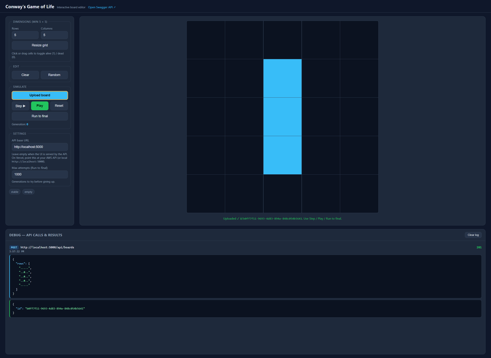

# Conway's Game of Life API

ASP.NET Core Web API implementing Conway's Game of Life using C# and **.NET 9**. Board definitions are persisted in SQLite so a process restart or crash does not lose uploaded boards.

## Architecture

```text
HTTP
  |
  v
BoardsController
  |
  v
GameOfLifeService ----> GameOfLifeEngine
  |                         |
  v                         v
BoardRepository         BoardState
  |
  v
EF Core / SQLite
```

### Design decisions

- **.NET 9 / ASP.NET Core**: current supported framework above the requested .NET 7 baseline.
- **SQLite + EF Core**: durable local persistence with no external infrastructure requirement. The database file is mounted as persistent storage in the container example.
- **Immutable uploaded board**: an upload stores the initial state. Generation endpoints calculate from that initial state and do not mutate it. This makes GET requests deterministic and idempotent.
- **Deterministic engine**: `BoardState.Next()` implements the standard 8-neighbor Conway rules.
- **Bounded final-state search**: `/final?maxAttempts=N` stops after N generations. Empty and stable states are conclusions. Cycles are detected and reported as having no final stable state.
- **No in-memory board registry**: only the persisted initial state is required to reconstruct any generation after a restart.
- **Cancellation**: long-running generation requests observe ASP.NET's request cancellation token.


# Conway’s Game of Life — API Design

## Overview

The system exposes a REST API for Conway’s Game of Life. A board consists of a rectangular grid of cells, where each cell is either **alive** or **dead**. Each generation is deterministically calculated from the previous generation using Conway’s four rules:

1. A live cell with fewer than 2 neighbors dies.
2. A live cell with 2 or 3 neighbors survives.
3. A live cell with more than 3 neighbors dies.
4. A dead cell with exactly 3 neighbors becomes alive.

The implementation is designed around an immutable-style `BoardState` abstraction: calculating the next generation creates a new board rather than modifying the current state.

## Architecture

```text
                    ┌───────────────────┐
                    │      Web UI        │
                    └─────────┬─────────┘
                              │ HTTP
                              ▼
                    ┌───────────────────┐
                    │    REST API       │
                    │  ASP.NET Core     │
                    └─────────┬─────────┘
                              │
                    ┌─────────▼─────────┐
                    │   Board Service    │
                    └─────────┬─────────┘
                              │
                    ┌─────────▼─────────┐
                    │    BoardState      │
                    │                   │
                    │  bool[,] cells    │
                    │  Parse()          │
                    │  Next()           │
                    │  IsEmpty          │
                    │  IsStableWith()   │
                    │  Fingerprint()    │
                    └─────────┬─────────┘
                              │
                              ▼
                    ┌───────────────────┐
                    │     SQLite        │
                    │ Board persistence  │
                    └───────────────────┘
```

## Domain Model

`BoardState` owns the representation and rules for a single generation.

```text
BoardState
 ├── Rows
 ├── Columns
 ├── Cell[row,column]
 ├── Next()
 ├── IsEmpty
 ├── IsStableWith()
 ├── ToRows()
 └── Fingerprint()
```

The board is represented internally as a `bool[,]`:

* `true` = alive
* `false` = dead

Input is parsed from textual representations such as `#` and `.`, with validation ensuring the board is non-empty, rectangular, and contains valid cell values.

## Generation Algorithm

For every cell, the implementation examines the eight surrounding positions. Boundary checks prevent access outside the board.

```text
Current Generation
        │
        ▼
For each cell
        │
        ▼
Count up to 8 neighbors
        │
        ▼
Apply Conway's rules
        │
        ▼
Write to NEW board
        │
        ▼
Next Generation
```

The current board is never modified while calculating the next generation. This prevents newly calculated cells from affecting calculations for other cells in the same generation.

## Complexity

For an `R × C` board:

* **Time:** `O(R × C)` per generation
* **Additional memory:** `O(R × C)` for the next generation
* Each cell examines at most eight neighbors, making the constant factor small.

The implementation favors clarity and correctness over premature optimization. For extremely large sparse boards, a sparse representation or neighbor-counting approach could reduce memory and processing requirements.

## Persistence and API

Board states can be persisted and retrieved through the API, allowing clients to:

* Upload an initial board and receive an identifier.
* Retrieve the next generation.
* Retrieve a board several generations into the future.
* Interact with the implementation through the accompanying web UI.

A `Fingerprint()` provides a deterministic textual representation of a board and can support state comparison, caching, and future cycle detection.

## Design Principles

* **Deterministic:** identical input states always produce identical next states.
* **Separation of concerns:** API, persistence, and Game of Life domain logic are separated.
* **Non-mutating generation:** each generation is represented as a new board state.
* **Validated input:** malformed or non-rectangular boards are rejected.
* **Testable domain logic:** the rules can be tested independently of HTTP and persistence.
* **Extensible:** the board representation and domain logic can evolve independently of the API contract.

The implementation intentionally keeps the core Game of Life algorithm simple and isolated, making the behavior easy to reason about, test, and extend.

## API

### 1. Upload a board

`POST /api/boards`

Request:

```json
{
  "rows": [
    ".....",
    "..#..",
    "..#..",
    "..#..",
    "....."
  ]
}
```

Cells may be represented by `#`/`.` (alive/dead). The implementation also accepts `1`/`0`, `X`/`x`, `O`/`o`, `_`, and spaces.

Response: `201 Created`

```json
{"id":"..."}
```

### 2. Get next state

`GET /api/boards/{id}/next`

Returns generation 1 from the uploaded state.

### 3. Get N states away

`GET /api/boards/{id}/states/{generations}`

Examples:

```text
GET /api/boards/{id}/states/0
GET /api/boards/{id}/states/100
```

### 4. Get final state

`GET /api/boards/{id}/final?maxAttempts=1000`

A final state is reached when the board is stable (next generation is identical) or empty. If it cycles or does not conclude within the requested attempt limit, the API returns `422 Unprocessable Entity`.

## Persistence / restart behavior

The default connection string is:

```text
Data Source=data/gameoflife.db
```

The application creates the database schema on startup. The uploaded board is a database row containing its dimensions and canonical serialized state. Nothing required to reconstruct a board is held only in process memory.

To demonstrate restart persistence:

```bash
dotnet run --project src/GameOfLife.Api
# POST a board and save its returned id
# stop the process
# start it again
# GET /api/boards/{id}/next
```

The same board remains available.

## Run

Prerequisite: .NET 9 SDK.

```bash
dotnet restore
dotnet build

dotnet test
DOTNET_ENVIRONMENT=Development dotnet run --project src/GameOfLife.Api
```

The board editor is at http://localhost:5000/. Visual Studio’s `http` profile opens `start.html`, which shows the editor beside Swagger.

## Web UI



The default pattern is a vertical blinker. Click or drag cells to toggle live (blue) and dead. Then **Upload board** so the API can simulate it.

### Dimensions

| Control | What it does |
| --- | --- |
| **Rows** / **Columns** | Grid size. Minimum is 5 × 5, maximum is 100 × 100. |
| **Resize grid** | Applies the new size. Existing live cells are kept where they still fit. You must upload again after resizing. |

### Edit

| Control | What it does |
| --- | --- |
| **Clear** | Sets every cell to dead. Invalidates the last upload. |
| **Random** | Fills about 30% of cells at random. Invalidates the last upload. |

### Simulate

These stay disabled until a board is uploaded. After the board becomes empty or stable, **Step**, **Play**, and **Run to final** grey out until you upload a new board or **Reset**. A blinker cycles, so it never reaches a final state.

| Control | What it does |
| --- | --- |
| **Upload board** | `POST /api/boards` with the current grid. Returns an id and enables the other simulate controls. |
| **Step ▶** | Advances one generation (`GET /api/boards/{id}/states/{n}`). |
| **Play** / **Pause** | Steps automatically every 300 ms. Pause stops the timer. |
| **Reset** | Returns to generation 0 of the uploaded board. |
| **Run to final** | Calls `GET /api/boards/{id}/final` until the board is stable or empty. Cycles and attempt limits return an error. |

### Settings

| Control | What it does |
| --- | --- |
| **API base URL** | Host for API calls. Leave empty when the UI is served by this app. On Vercel, use `https://localhost:5001` while the API is running locally (trust the ASP.NET HTTPS certificate with `dotnet dev-certs https --trust`), or your AWS HTTPS API. HTTP `localhost` is blocked by the browser because Vercel is HTTPS. |
| **Max attempts** | Generation cap for **Run to final** (1–10,000). |

**stable** and **empty** light up when the current generation is a still life or has no live cells. The debug panel at the bottom logs each HTTP request and the JSON response. **Clear log** empties that panel.

Swagger is also at `/swagger`.

## Docker

```bash
docker build -t game-of-life-api .
docker run --rm -p 8080:8080 -v gameoflife-data:/app/data game-of-life-api
```

The named volume makes the SQLite database survive container replacement.

## Tests

The test suite covers:

- Conway birth/survival/death rules.
- Blinker evolution.
- Board upload and returned id.
- Next-generation endpoint.
- N-generations endpoint.
- Stable final-state detection.
- Cycle detection.
- Attempt-limit error behavior.
- Not-found behavior.
- Persistence across two application hosts using the same SQLite file.
- Input validation.

Integration tests use ASP.NET Core's `WebApplicationFactory`, which is the standard ASP.NET Core integration-test mechanism. See Microsoft's documentation for the testing model.

EF Core's SQLite provider is used for durable relational persistence; SQLite is supported directly by EF Core.

## Example curl

```bash
curl -X POST http://localhost:5000/api/boards \
  -H 'Content-Type: application/json' \
  -d '{"rows":[".....","..#..","..#..","..#..","....."]}'

curl http://localhost:5000/api/boards/{id}/next
curl http://localhost:5000/api/boards/{id}/states/100
curl 'http://localhost:5000/api/boards/{id}/final?maxAttempts=1000'
```
